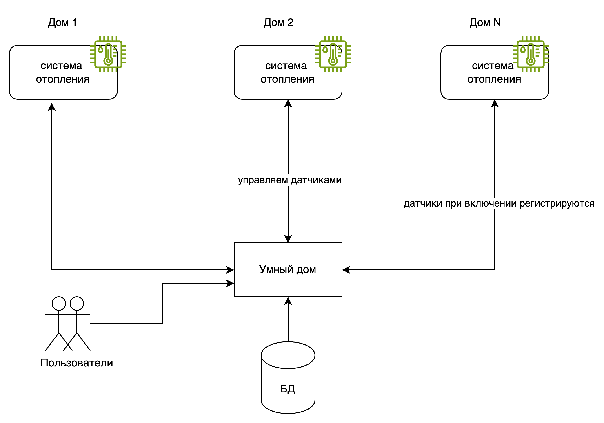

# Project_template

Это шаблон для решения проектной работы. Структура этого файла повторяет структуру заданий. Заполняйте его по мере работы над решением.

# Задание 1. Анализ и планирование

<aside>

Чтобы составить документ с описанием текущей архитектуры приложения, можно часть информации взять из описания компании и условия задания. Это нормально.

</aside

### 1. Описание функциональности монолитного приложения

**Пользователи системы:**

- 100 модулей управления (100 домов)

**Управление отоплением:**

- Пользователи могут управлять температурой в доме и проверять ее.
- Система поддерживает только определенные датчики и реле.
- Для подключения датчика к системе нужен выезд мастера.

**Мониторинг температуры:**

- Пользователи могут получать текущую температуру по запросу.
- API позволяет получить температуру по локации + есть crud операции по id датчика.
  
### 2. Анализ архитектуры монолитного приложения

Монолит на Go + субд Postgres, синхронное взаимодействие. 


### 3. Определение доменов и границы контекстов

1. Домен системы управления отоплением
   1. поддомен мониторинга температуры
      1. контекст мониторинга температуры. Термины: датчик, текущая темпераутры
   2.  поддомен управления системой отопления
      1. контекст управления отоплением. Термины: контроллер системы отопления, изменение температуры
2. Домен системы регистрации пользователей
   1. контекст подключением новых пользователй. Термины: установка датчика, подключение, оплата, регистрация

### **4. Проблемы монолитного решения**

- Нет возможности самостоятельно подключиться к системе.
- Нет поддержки других типов устройств умного дома.
- Текущая архитектура не адаптирована под большое число пользователей: все запросы к системе задействуют запросы к базе, база организована, как единственная таблица, что может стать узким горлышком.
- В случае падения системы, пользователи полностью теряют контроль над датчиками (не могут ни проверять значение, ни менять его).
- Нет CRM и системы подписок/обработки платежей

### Размышления:
- Бизнесу требуется расширение для создания экосистемы для поселков на территории нескольких регионов. Предположим, что планируется покрыть 10 регионов. В среднем по России в регионе находится 2000 поселений. Будем считать, что в каждом поселении 10 домов. Пусть планируется покрыть 50% поселений в 10 регонах, в каждом доме будет в среднем до 5 датчиков, тогда получаем 10 регионов * 2000 поселений * 0,5 (покрытие в регионе) * 10 домов * 5 датчиков = 500 000  новых подключений. Лучше взять с запасом на 1 млн. Если считать, что каждый пользователь запрашивает 10  раз в сутки показания датчика, и 5 раз меняет его, то имеем нагрузку: 
  100 RPS на проверку показаний датчиков
  50 RPS на изменение значений.
Итого:
 DAU (1 дом = 1 пользователь): 100 000
 Нагрузка на чтение показаний: 100 RPS
 Нагрузка на изменение значений: 50 RPS


### 5. Визуализация контекста системы — диаграмма С4

Добавьте сюда диаграмму контекста в модели C4.

Чтобы добавить ссылку в файл Readme.md, нужно использовать синтаксис Markdown. Это делают так:

[Тёплый дом C1 ASIS Diagram](diagrams\generated\context\ASIS_WarmhouseContext.png)


# Задание 2. Проектирование микросервисной архитектуры

В этом задании вам нужно предоставить только диаграммы в модели C4. Мы не просим вас отдельно описывать получившиеся микросервисы и то, как вы определили взаимодействия между компонентами To-Be системы. Если вы правильно подготовите диаграммы C4, они и так это покажут.

**Домены системы TOBE**
1. Домен: Экосистема управления умным домом
	1. core поддомен: управление и сценарии для устройств
		1. контекст: реестр устройств
		2. контекст: набор устройств у конкретного пользователя
		3. контекст: автоматизации
	2. support поддомен: продажа устройств
	3. support поддомен: мониториг и диагностика
	4. generic поддомен: управление пользователями
		1. контекст: регистрация + безопасность
		2. контекст: ролевая модель
		3. контекст: аудит
	5. generic поддомен: обслуживание клиентов
		1. контекст: поддержки
		2. контекст: маркетинга


**Диаграмма контейнеров (Containers)**

[path](diagrams\generated\container\TOBE_WarmhouseContainer.png)


**Диаграмма компонентов (Components)**

[path](diagrams\generated\component\BFF  Mobile Component.png)


[path](diagrams\generated\component\UserProfile Component.png)


[path](diagrams\generated\component\AutomationService Component.png)


[path](diagrams\generated\component\DeviceAdapter Component.png)


**Диаграмма кода (Code)**

[path](diagrams\generated\code\automation.png)


# Задание 3. Разработка ER-диаграммы

Добавьте сюда ER-диаграмму. Она должна отражать ключевые сущности системы, их атрибуты и тип связей между ними.

# Задание 4. Создание и документирование API

### 1. Тип API

Укажите, какой тип API вы будете использовать для взаимодействия микросервисов. Объясните своё решение.

### 2. Документация API

Здесь приложите ссылки на документацию API для микросервисов, которые вы спроектировали в первой части проектной работы. Для документирования используйте Swagger/OpenAPI или AsyncAPI.

# Задание 5. Работа с docker и docker-compose

Перейдите в apps.

Там находится приложение-монолит для работы с датчиками температуры. В README.md описано как запустить решение.

Вам нужно:

1) сделать простое приложение temperature-api на любом удобном для вас языке программирования, которое при запросе /temperature?location= будет отдавать рандомное значение температуры.

Locations - название комнаты, sensorId - идентификатор названия комнаты

```
	// If no location is provided, use a default based on sensor ID
	if location == "" {
		switch sensorID {
		case "1":
			location = "Living Room"
		case "2":
			location = "Bedroom"
		case "3":
			location = "Kitchen"
		default:
			location = "Unknown"
		}
	}

	// If no sensor ID is provided, generate one based on location
	if sensorID == "" {
		switch location {
		case "Living Room":
			sensorID = "1"
		case "Bedroom":
			sensorID = "2"
		case "Kitchen":
			sensorID = "3"
		default:
			sensorID = "0"
		}
	}
```

2) Приложение следует упаковать в Docker и добавить в docker-compose. Порт по умолчанию должен быть 8081

3) Кроме того для smart_home приложения требуется база данных - добавьте в docker-compose файл настройки для запуска postgres с указанием скрипта инициализации ./smart_home/init.sql

Для проверки можно использовать Postman коллекцию smarthome-api.postman_collection.json и вызвать:

- Create Sensor
- Get All Sensors

Должно при каждом вызове отображаться разное значение температуры

Ревьюер будет проверять точно так же.


